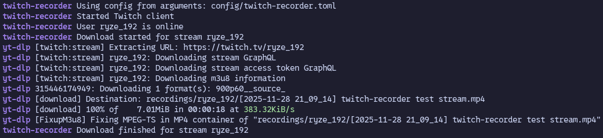

<div align="center">

# Twitch-Recorder


</div>


Twitch application for automatically downloading streams as they go live.<br/>
Particularly useful for archiving streams that have disabled VODs.

# Installation
twitch-recorder can be installed from PyPI and Nix/NixOS as a package or configured as a service with the module from [stackpkgs](https://code.thishorsie.rocks/ryze/stackpkgs).<br/>
After installing you should be able to run twitch-recorder from the terminal.

## PyPI
```sh
pip install twitch-recorder
```

## Nix/NixOS
```nix
# Install just the package
environment.systemPackages = [
    pkgs.stackpkgs.twitch-recorder
];

# Or configure the service
services.twitch-recorder = {
    enable = true;

    # You can use environment file to safely store client details
    environmentFile = "/var/lib/secrets/twitch-recorder.env";
    settings = {
        twitch = {
            client_id = "$CLIENT_ID";
            client_secret = "$CLIENT_SECRET";
            token = "$TOKEN";
        };
    };
};
```

# Configuration
twitch-recorder is configured using TOML, an example configuration file with defaults can be found [here](config/twitch-recorder.toml).

On Linux and macOS, configuration file can be placed at the following paths, in order of priority:
1. `$XDG_CONFIG_HOME/twitch-recorder.toml`
2. `$HOME/.config/twitch-recorder.toml`
3. `/etc/twitch-recorder.toml`

On Windows, the file should be placed at `%APPDATA%/twitch-recorder/twitch-recorder.toml`

You can also specify path to the configuration file by setting environment variable `TWITCH_RECORDER_CONFIG` or with command line flags `-c` and `--config`.

In the config you need to set client ID, client secret and token provided by Twitch for your application, as well as a list of users to watch.

# Registering application and obtaining the user token
To register application for use with twitch-recoder, go to [this page](https://dev.twitch.tv/console/apps/create) on Twitch developer console.

On the page, fill in the details and click the create button. Make sure the redirect URL is set to something local (e.g. `https://localhost`) and client type is set to "Confidential". Next, click on the application you just created and press "New secret key" button. Now copy the client ID and the client secret from respective fields and put them to your config.

To obtain the user token you need to authorize the application using your Twitch account by going to this URL:
```
https://id.twitch.tv/oauth2/authorize?client_id=CLIENT_ID&client_secret=CLIENT_SECRET&redirect_uri=REDIRECT_URI&response_type=token&scopes=
```
Replace `CLIENT_ID`, `CLIENT_SECRET` and `REDIRECT_URI` with values for your application.

After authorization Twitch will redirect you to a URL similar to:
```
https://localhost/#access_token=TOKEN$&scope=&token_type=bearer
```
Where `TOKEN` is the token you should put in your config.

# Limitations
- You cannot watch more than 10 **unauthorized**  users per client ID and token pair. This is a limitation imposed by Twitch for their EventSub API. Note, users that have authorized your application do not count towards this limit.
- Ad stubs may appear in the resulting videos. There isn't much twitch-recoder can do about this, as the [issue](https://github.com/yt-dlp/yt-dlp/issues/1089) is on yt-dlp side.

# Development
twitch-recorder requires the following tools for development:
- [uv](https://github.com/astral-sh/uv) - building and managing the Python project;
- [ruff](https://github.com/astral-sh/uv) - linter and code formatter;
- [mypy](https://github.com/python/mypy) - type checking;

Install them on your system or use virtualenv.
You can also use provided development shell for Nix.

# Used libraries
- [TwitchIO](https://github.com/PythonistaGuild/TwitchIO) - interacting with Twitch API
- [yt-dlp](https://github.com/yt-dlp/yt-dlp) - downloading the actual video streams
- [pyserde](https://github.com/yukinarit/pyserde) - [serde](https://github.com/serde-rs/serde)-like style deserialization for configuration
